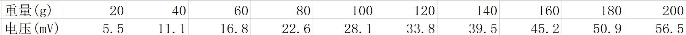
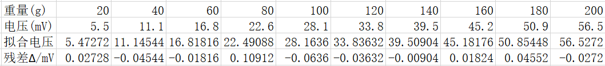
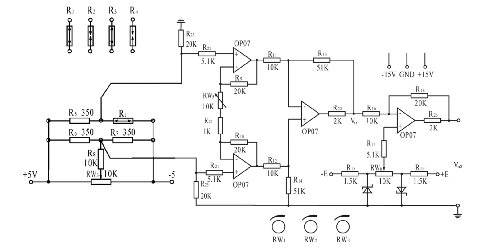
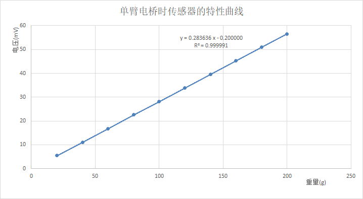
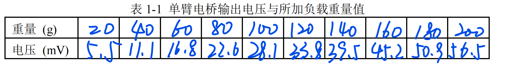
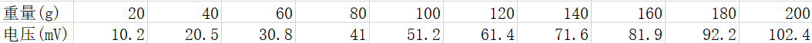

#
<big> 超声波在固体中的传输实验报告

###
 姓名： 李昭阳&emsp;学号：2021013445&emsp;实验台号： 7&emsp;指导老师：张君宇&emsp; 实验日期：2023/05/12

##实验目的
&ensp;&ensp;&ensp;
1、本实验通过学习超导体的基本概念，理解理想导体与超导体的区别，加深对超
导材料两个基本特性的认识；
 
&ensp;&ensp;&ensp;
2、使用液氮冷却高温超导样品、用铂电阻温度计测量温度，初步了解低温技术。用四引线法测量高温超导样品的电阻—温度特性，观察零电阻现象；
 
&ensp;&ensp;&ensp;
3、用电磁感应法测量超导样品对互感线圈感应电压的影响，获得感应电压—温度特性，了解完全抗磁性。
##实验仪器
&ensp;&ensp;&ensp;
三路稳压稳流直流电源、信号发生器、5 位半数字万用表、4 位半数字万用表、手持数字万用表、液氮罐、测试探头、测试探头接线盒、电阻箱、双刀双掷换向开关、导线
##数据处理及结果

###用四引线法测量超导样品电阻

&ensp;&ensp;&ensp;
数字万用表两条引线电阻\\(R_w = 0.048 \Omega\\)
 
&ensp;&ensp;&ensp;
超导盒内样品与引线电阻之和\\(R_s = 0.483 \Omega\\)
 
&ensp;&ensp;&ensp;
样品和总负载电阻\\(R_Sc = 0.435 \Omega\\)
 
&ensp;&ensp;&ensp;
CH3工作模式：恒流，输出电压\\(V = 585 mV\\)，输出电流\\(I = 1A\\)，超导样品电阻\\(R = 0.3\Omega\\)

###用电流换向法消除乱真电势的影响

&ensp;&ensp;&ensp;
乱真电势为\\(U = \frac{V_1 + V_2}{2} = -0.0005mV\\)

###用铂电阻温度计测量温度

&ensp;&ensp;&ensp;
限流电阻\\(R = 599000 \Omega\\)
 
&ensp;&ensp;&ensp;
计算四位半数字电压表的显示初值\\(V = 108.46 mV\\)
 
&ensp;&ensp;&ensp;
实际四位半电压表数值\\(V = 110.60mV\\)
 
&ensp;&ensp;&ensp;
CH1工作模式：恒压，输出电压\\(V = 60 V\\)，输出电流\\(I = 0 mA\\)

###用电磁感应法测超导样品对感应电压的影响

&ensp;&ensp;&ensp;
调整信号发生器的幅度设置，使数字万用表显示的感应电压为约\\(20 mV\\) ，此时\\(Vpp = 4.383 V\\)。

###降温试验

###原始数据

###数据作图与分析

&ensp;&ensp;&ensp;
降温实验时，电阻在达到\\(-173℃\\)附近时迅速下降为0，同时感应电压迅速下降，但由于超导样品较小且处于两个线圈之间，并没有将初级线圈与次级线圈完全屏蔽，依旧能测得感应电压。

###升温试验

###原始数据

###数据作图与分析

&ensp;&ensp;&ensp;
升温实验时，样品电阻在达到转变温度时迅速上升，同时感应电压出现了先上升又下降现象，与实验前预期结果相符合。

##预习报告

##原始数据记录

