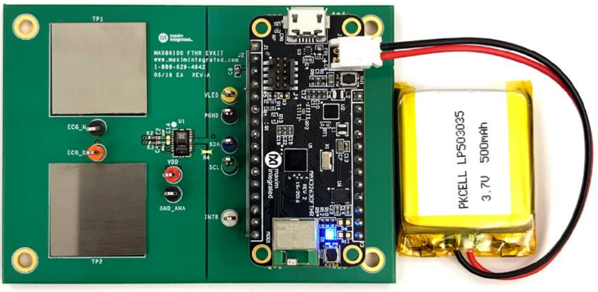
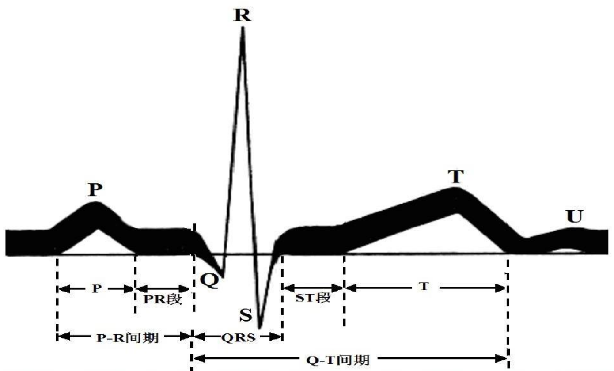
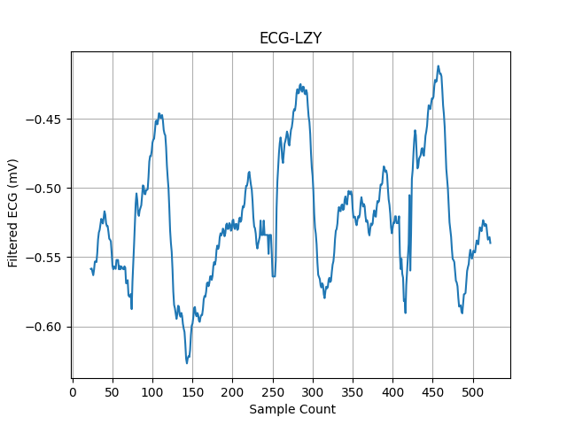
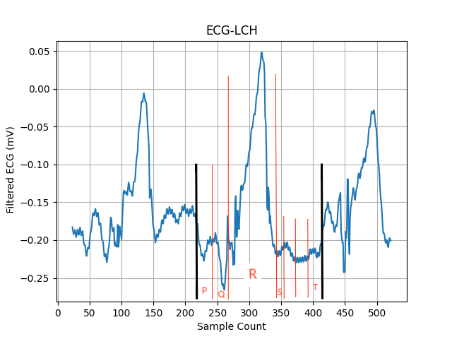
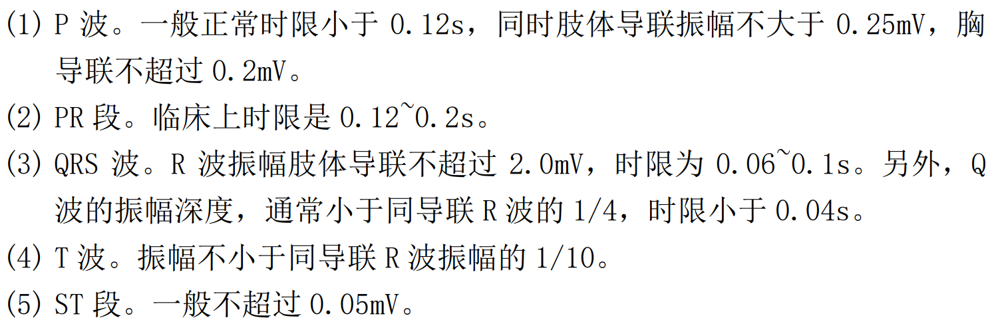

  

#
<big>ECG 及 PPG 心电心率实验报告
   

  

###**
 自动化系**
###**
 李昭阳 2021013445**

 

##实验准备

###实验目的

&ensp;&ensp;&ensp;
（1）通过 ECG+PPG 系统的实际操作，深入了解心电和光电容积传感器基本原理；
 
&ensp;&ensp;&ensp;
（2）培养实验者对心电图和光电式心率图的人工解读和机器解读能力。

###实验设备和材料

&ensp;&ensp;&ensp;
ECG+PPG 实验系统 Maxim86150
##基本原理

### ECG 系统原理

&ensp;&ensp;&ensp;
心电是心脏电位的变化在人体内传播形成的电信号。心脏的窦房结细胞自律性地产生电信号，并通过特殊通道传导至心脏各部分，形成心电图上的各个波形。
 
&ensp;&ensp;&ensp;
心电图样例如下，

&ensp;&ensp;&ensp;
(1) P 波:反映心房肌在除极过程中的电位变化过程;
 
&ensp;&ensp;&ensp;
(2) P-R 间期:反映的是激动从窦房结通过房室交界区到心室肌开始除极的时限;
 
&ensp;&ensp;&ensp;
(3) QRS 波群:反映心室肌除极过程的电位变化;
 
&ensp;&ensp;&ensp;
(4) T 波:代表心室肌复极过程中所引起的电位变化;
 
&ensp;&ensp;&ensp;
(5) S-T 段:从 QRS 波群终点到达 T 波起点间的一段水平线;
 
&ensp;&ensp;&ensp;
(6) Q-T 间期:心室从除极到复极的时间;
 
&ensp;&ensp;&ensp;
(7) U 波:代表动作电位的后电位。

### PPG 系统原理

&ensp;&ensp;&ensp;
PPG 是一种将光照进皮肤并测量因血液流动而产生的光散射的方法。光学心率传感器基于以下工作原理：当血流动力发生变化时，例如血脉搏率（心率）或血容积（心输出量）发生变化时，进入人体的光会发生可预见的散射。
 
&ensp;&ensp;&ensp;
PPG 设备可测量心率、心率变异性指标 HRV。
##实验结果

### ECG 系统实验

&ensp;&ensp;&ensp;
整理实验数据，截取lzy同学和lch同学某段ECG数据，以lch同学的数据为例进行分析，标注单个周期内各波的区域范围如下图，

&ensp;&ensp;&ensp;
由原始数据平均计算可知，相邻两个\\(Sample Count\\)之间，时间差大约为\\(5 ms\\)。因此可估计lch同学，
 
&ensp;&ensp;&ensp;
\\(P\\) 波的时限约为 \\(110 ms\\)，肢体导联振幅约为 \\(0.03 mV\\)；
 
&ensp;&ensp;&ensp;
\\(P-R\\) 段的时限约为 \\(90 ms\\)；
 
&ensp;&ensp;&ensp;
\\(R\\) 波的时限约为 \\(250 ms\\)，肢体导联振幅约为 \\(0.15 mV\\)；
 
&ensp;&ensp;&ensp;
\\(Q\\) 波的时限约为 \\(50 ms\\)，肢体导联振幅约为 \\(0.06 mV\\)；
 
&ensp;&ensp;&ensp;
\\(T\\) 波的肢体导联振幅约为 \\(0.02 mV\\)；
 
&ensp;&ensp;&ensp;
根据下图给出的评估标准，

&ensp;&ensp;&ensp;
可知，lch同学的Q波的导联振幅过大，R波导联时限过长，但是偏移范围均很小，考虑到误差影响，可以认为lch同学身体健康。
 
&ensp;&ensp;&ensp;
同理分析，lzy同学的Q波的导联振幅过大，R波导联时限过长，但是偏移范围均很小，与lch同学的情况类似，故两者可判定为仪器的误差影响，可以认为lzy同学身体健康。

### PPG 系统实验

##反思
&ensp;&ensp;&ensp;
本次实验中，各项试验的完成度较好，同时收集的各项数据也比较精准、易于分析结论。我在之前对实验的顺序策略有错误估计，重复搭建了各类测量电路，降低了实验速度。同时在预估计时存在一些失误。在以后的实验过程中，我会更认真地进行预习规划，同时也会在以后的实验过程中更加谨慎，以保证实验结果更加准确。