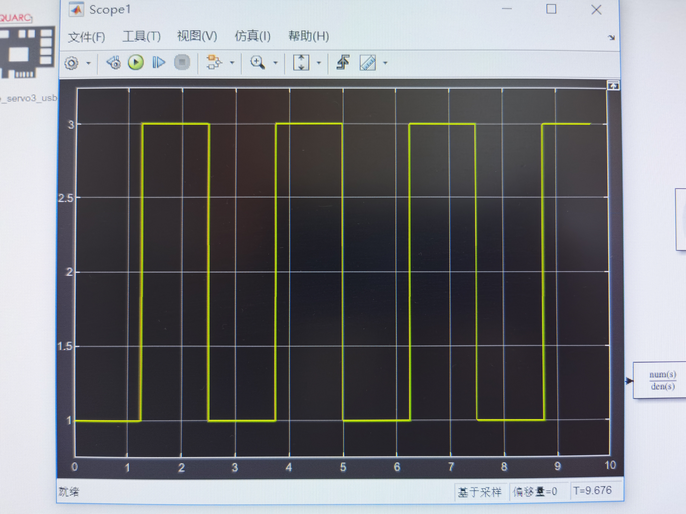
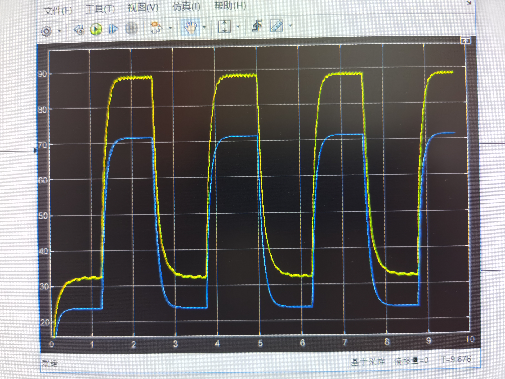
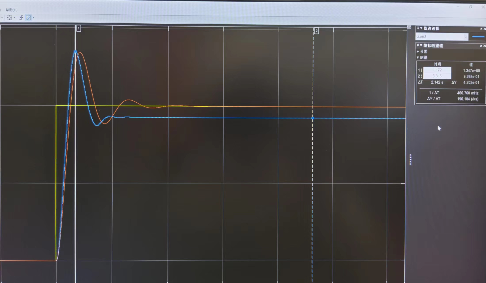
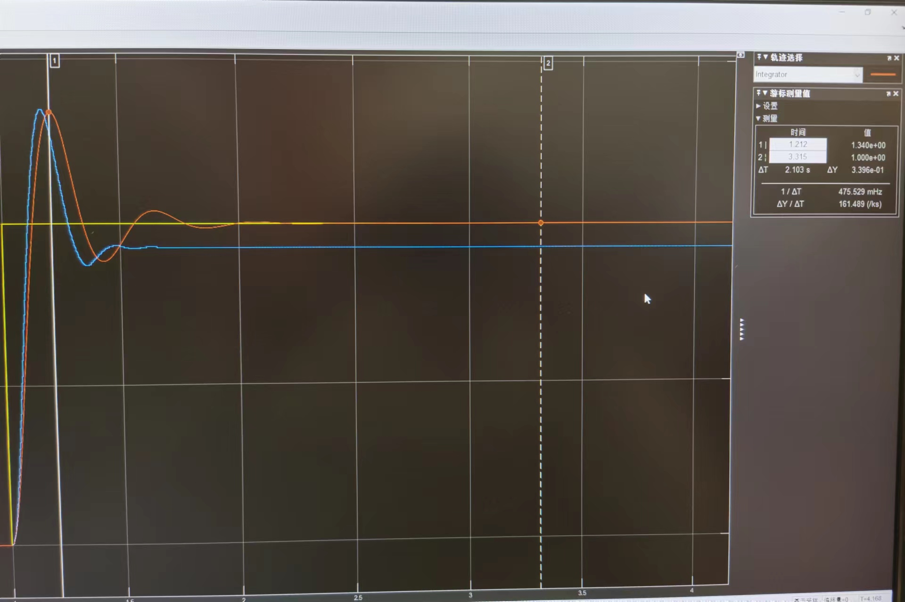
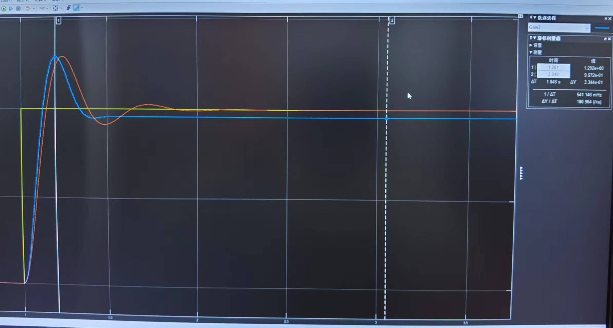
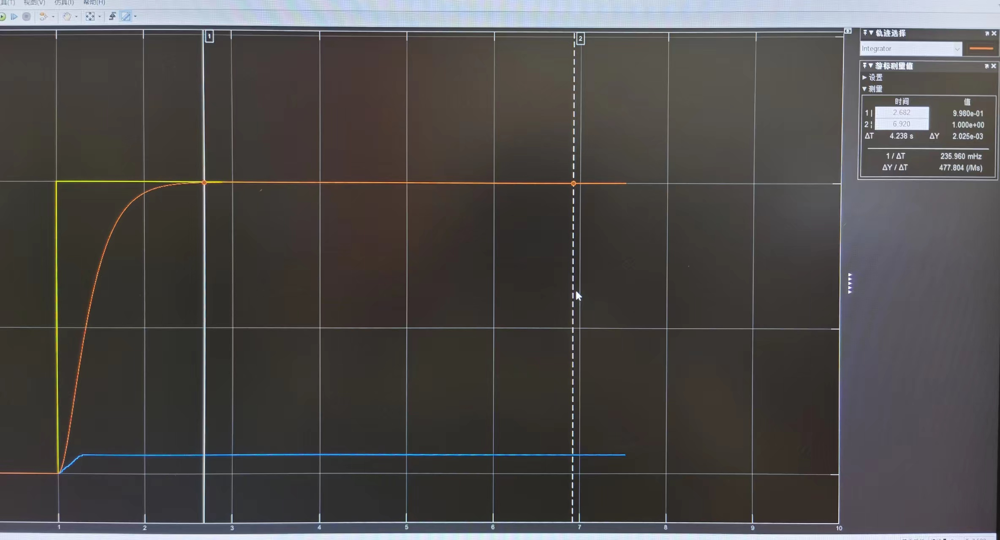
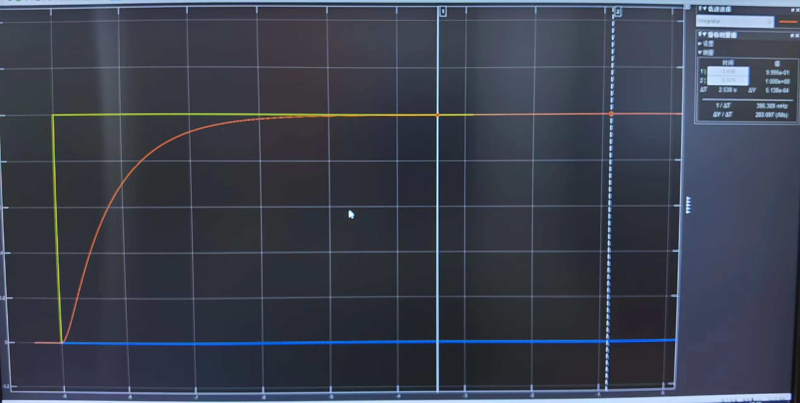

#
<big> 自动控制原理 I 实验1实验报告

###
 姓名： 李昭阳&emsp;学号：2021013445&emsp; 实验日期：2023/10/18

##实验目的
&ensp;&ensp;&ensp;
1、了解 Qube 硬件系统、Quarc 软件系统与 MATLAB 及 Simulink 的融合使用；
 
&ensp;&ensp;&ensp;
2、完成电机从电压到转速的一阶系统建模，对比理论仿真模型和实际硬件系统在相同电压下电机的输出转速的区别；
 
&ensp;&ensp;&ensp;
3、完成电机从电压到转角的二阶系统建模，得到理论模型与实际系统的阶跃响应曲线，保存图片，测量超调量和过渡过程时间；通过改变增益 Gain 获得不少于 3 组时间常数 T 和阻尼比 ξ，得到不同参数下系统的阶跃响应曲线。
##实验仪器
&ensp;&ensp;&ensp;
QUBE-Servo 2 实验系统、MATLAB & Simulink、QUARC

##电压到转速的一阶系统建模

&ensp;&ensp;&ensp;
由图可知，实际硬件系统在相同电压下电机的输出转速大于理论仿真。同时，实际硬件系统的输出转速会在一定平均值附近小范围抖动。
 
&ensp;&ensp;&ensp;
分析其误差原因，对于输出转速大于理论仿真，我认为是不同硬件系统的参数略有差别，使得理论仿真的传递函数并不等于实际硬件系统的传递函数；对于转速小范围抖动，我认为是仿真建模时不包含未建模动力学，如摩擦等、忽略了电机电感等原因造成的。

##电压到转角的二阶系统“硬件在环实验”

###电压到转角的二阶系统建模

&ensp;&ensp;&ensp;
画出理论模型与实际系统的阶跃响应曲线如下。

&ensp;&ensp;&ensp;
计算理论模型\\(T = \sqrt{\frac{\tau}{K}} = \sqrt{\frac{0.0995}{23.8095}} = 0.065s\\)，\\(\xi = \frac{1}{2\sqrt{K\tau}} = 0.325\\)，则可以求得，
$$\sigma = e^{-\frac{\xi \pi}{\sqrt{(1 - \xi ^2)}}} \times 100\%= 33.97\%$$
$$t_s(2\%) = \frac{4T}{\xi} = 0.800s$$
 
&ensp;&ensp;&ensp;
读取实际系统的过渡过程时间约为0.7s，计算超调量，
$$\sigma = \frac{y_m - y(\inf)}{y(\inf)} \times 100\% = 45.38\%$$
 
&ensp;&ensp;&ensp;
理论模型的超调量相较于实际系统更低，而过渡过程时间更长。我认为这与实际系统的电机电感、摩擦有关。

###改变增益 Gain 获得不少于 3 组时间常数 T 和阻尼比 ξ，得到不同参数下系统的阶跃响应曲线

&ensp;&ensp;&ensp;
改变系统增益为0.80，求得\\(T = \sqrt{\frac{\tau}{K}} = 0.072s\\)，\\(\xi = \frac{1}{2\sqrt{K\tau}} = 0.363\\)，系统为欠阻尼状态，得到阶跃响应曲线如下，

&ensp;&ensp;&ensp;
计算理论模型超调量和过渡过程时间，
$$\sigma = e^{-\frac{\xi \pi}{\sqrt{(1 - \xi ^2)}}} \times 100\%= 29.41\%$$
$$t_s(2\%) = \frac{4T}{\xi} = 0.793s$$
&ensp;&ensp;&ensp;
读取实际系统的过渡过程时间约为0.7s，计算超调量，
$$\sigma = \frac{y_m - y(\inf)}{y(\inf)} \times 100\% = 34.98\%$$
 
&ensp;&ensp;&ensp;
理论模型的超调量相较于实际系统更低，而过渡过程时间更长。我认为这与实际系统的电机电感、摩擦有关。
 
&ensp;&ensp;&ensp;
改变系统增益为0.1050，求得\\(T = \sqrt{\frac{\tau}{K}} = 0.199s\\)，\\(\xi = \frac{1}{2\sqrt{K\tau}} = 1.00\\)，系统为临界阻尼状态，得到阶跃响应曲线如下，

&ensp;&ensp;&ensp;
计算理论模型超调量和过渡过程时间，
$$\sigma = e^{-\frac{\xi \pi}{\sqrt{(1 - \xi ^2)}}} \times 100\%= 0\%$$
$$t_s(2\%) = \frac{4T}{\xi} = 0.796s$$
&ensp;&ensp;&ensp;
由于电机的开启电压等因素限制，实际硬件系统无法完成小增益下的实验，无法计算超调量与过渡过程时间。
 
&ensp;&ensp;&ensp;
改变系统增益为0.050，求得\\(T = \sqrt{\frac{\tau}{K}} = 0.289s\\)，\\(\xi = \frac{1}{2\sqrt{K\tau}} = 1.45\\)，系统为过阻尼状态，得到阶跃响应曲线如下，

&ensp;&ensp;&ensp;
计算理论模型超调量和过渡过程时间，
$$\sigma = e^{-\frac{\xi \pi}{\sqrt{(1 - \xi ^2)}}} \times 100\%= 0\%$$
$$t_s(2\%) = \frac{4T}{\xi} = 0.797s$$
&ensp;&ensp;&ensp;
由于电机的开启电压等因素限制，实际硬件系统无法完成小增益下的实验，无法计算超调量与过渡过程时间。
 
&ensp;&ensp;&ensp;
综上，时间常数越小，系统的响应速度越快，反之，时间常数越大，系统的响应速度越慢。较小的时间常数会导致系统快速响应，但也可能引入振荡或不稳定的行为；较大的时间常数会使系统响应更平稳，但响应速度较慢，可能不足以满足某些应用的性能需求。
 
&ensp;&ensp;&ensp;
阻尼系数是描述系统阻尼程度的参数，当阻尼系数\\(\xi = 1\\)时，系统呈临界阻尼状态，这时系统响应速度较快，且不会产生振荡；阻尼系数\\(\xi < 1\\)时，系统呈过阻尼状态，响应速度较慢，但没有振荡；当阻尼系数\\(\xi > 1\\)时，系统呈欠阻尼状态，响应速度较快，但可能会引起振荡和不稳定。
##反思
&ensp;&ensp;&ensp;
本次实验中，各项试验的完成度较好，同时收集的各项数据也比较精准、易于分析结论。但我对MATLAB的使用不够熟悉我认为在以后的实验过程中，我会逐渐熟悉MATLAB的各种操作，同时也会在以后的实验过程中更加谨慎，以保证实验准确。
