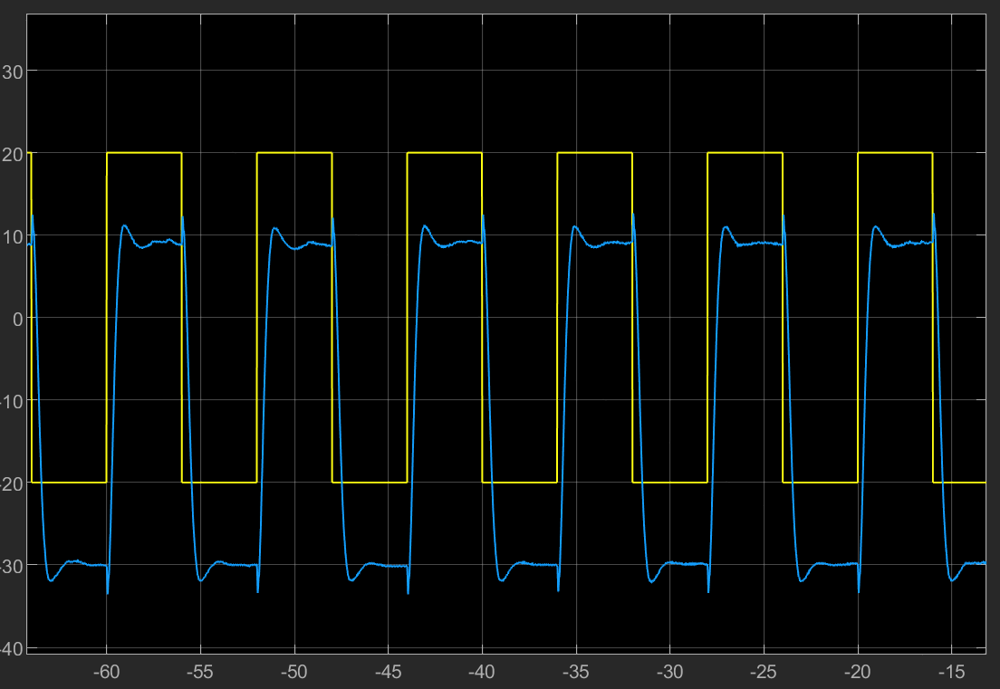

#
<big> 自动控制原理 I 实验2实验报告

###
 姓名： 李昭阳&emsp;学号：2021013445&emsp; 实验日期：2023/12/21

##实验目的
&ensp;&ensp;&ensp;
1、掌握极点配置算法，使用状态反馈实现系统控制；
 
&ensp;&ensp;&ensp;
2、研究不同极点配置对系统闭环响应的影响；
##实验仪器
&ensp;&ensp;&ensp;
QUBE-Servo 2 实验系统、\\(MATLAB\\) & \\(Simulink\\)、\\(QUARC\\)

##计算系统可控及期望极点选取

&ensp;&ensp;&ensp;
根据数据所给出的系统矩阵，使用 \\(MATLAB\\) 内置的函数 \\(ctrb(A, B)\\) 求解系统可控性，有以下结果。

&ensp;&ensp;&ensp;
由于 \\(R_c\\) 矩阵满秩，说明系统可控，可以采用极点配置。
 
&ensp;&ensp;&ensp;
由于要求超调量 \\(p_o ≤ 6.81\%\\)，过渡过程时间 \\(t_s ≤ 1.54s\\)，同时超调量和过渡过程时间有以下公式：
$$p_o = e^{-\frac{\xi \pi}{\sqrt{1 - \xi ^2}}} \times 100\%$$
$$t_s = \frac{3 - 4}{\omega_n \xi}$$
&ensp;&ensp;&ensp;
可以反解出 \\(\xi = 0.65\\)，\\(\omega_n = 4\\)，即得到一对主导极点 \\(p_1 = -2.600 + j3.040\\)，\\(p_2 = −2.600 - j3.040\\)。剩余极点应当远离主导极点，即 \\(p_3 = -40\\)，\\(p_4 = -45\\)。求出状态反馈控制增益矩阵 \\(K\\)，施加仿真，得到旋转臂转角追踪曲线如下，

&ensp;&ensp;&ensp;
由于绘图的失误，转角响应整体向下平移了10单位长度，但是其余情况均较好，超调量和周期均在预期范围内。
 
&ensp;&ensp;&ensp;
进一步得到旋转摆摆角平衡曲线如下，

 
&ensp;&ensp;&ensp;
改变极点为 \\([p_1, p_2, p_3, p_4] = [(-2.600 + j3.040), (−2.600 - j3.040), -30, -55]\\)，\\(K = [-4.0812, 46.4565, -1.5825, 3.1612]\\)，得到旋转臂转角追踪曲线如下，

&ensp;&ensp;&ensp;
进一步得到旋转摆摆角平衡曲线如下，

&ensp;&ensp;&ensp;
可以发现选取的本组极点所绘制的两个曲线，与第一组极点绘制的两个曲线差异很小。这是由于仅改变非主导极点，对系统的动态特性贡献很小。
 
&ensp;&ensp;&ensp;
但事实上，非主导极点的远离并不是完全没有影响。在实验过程中，我们发现，如果两个非主导极点均极度远离虚轴，那么系统会趋向于不稳定。
 
&ensp;&ensp;&ensp;
例如，取 \\(P = [(-2.600 + j3.040), (−2.600 - j3.040), -100, -105]\\)，求得 \\(K = [-4.0812, 46.4565, -1.5825, 3.1612]\\)。对比第一组极点，\\(K\\) 的各项数值都很大，对系统的控制非常激进。因此我认为这是由于倒立摆的硬件限制，使其无法适应如此激进的控制，故系统趋向于不稳定。
 
&ensp;&ensp;&ensp;
再改变极点为 \\([p_1, p_2, p_3, p_4] = [(-2.600 + j3.040), (−2.600 - j3.040), -60, -25]\\)，\\(K = [-3.7102, 43.4047,-1.4619, 3.0392]\\)，得到旋转臂转角追踪曲线如下，

&ensp;&ensp;&ensp;
进一步得到旋转摆摆角平衡曲线如下，

&ensp;&ensp;&ensp;
观察旋转臂转角追踪曲线，发现该旋转臂控制过渡过程时间较之前有所延长，这是由于其一个非主导极点更加靠近虚轴，对系统控制的贡献增大。
 
&ensp;&ensp;&ensp;
观察旋转摆摆角平衡曲线，发现顺旋转臂旋转方向，旋转摆摆角峰值减少，这是由于旋转臂过渡过程时间延长，摆动速度减小；同时，发现摆动到位后，逆旋转臂旋转方向，摆角峰值增大，这是由于旋转摆过渡过程时间延长，抵抗倒立摆惯性时间增大。
##反思
&ensp;&ensp;&ensp;
本次实验中，各项试验的完成度较好，同时除了一处图像存在整体平移偏差，其余收集的各项数据也比较精准、易于分析结论。我对MATLAB的使用愈加熟悉。我认为在以后的实验过程中，我会更熟悉MATLAB的各种操作，同时也会在以后的实验过程中更加谨慎，以保证实验准确。
